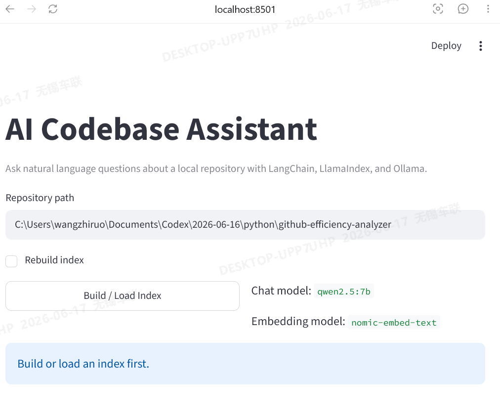

# AI Codebase Assistant



AI Codebase Assistant is a local-first codebase analysis assistant that indexes a checked-out repository, retrieves relevant implementation files, and answers natural-language questions with explicit `Answer`, `Why`, `Sources`, confidence labels, evidence panels, and cross-file relationship summaries.

Built with LangChain, LlamaIndex, Ollama, and Streamlit, it is designed for repository understanding and verification rather than generic AI summarization.

## Highlights

- source-grounded repository Q&A with explicit file citations
- cross-file relationship tracing for callers, definitions, imports, and output writers
- artifact-flow explanations for digests, reports, charts, and generated files
- implementation-backed design analysis with conservative confidence labels
- Streamlit UI with saved workspaces, evidence panels, and repo-specific suggested prompts
- VS Code one-click startup with the project virtual environment and fixed Streamlit port

## Overview

This project helps users ask questions about a local repository and get answers that are easier to verify in real files.

It is useful for tasks such as:

- retrieving real implementation files from a checked-out repository
- locating functions, configuration, and entrypoints
- tracing relationships across multiple files
- explaining how reports, charts, or output artifacts are generated
- surfacing implementation evidence instead of relying on free-form summaries

## Example questions

The assistant is designed for practical repository inspection tasks such as:

- finding where a function, config, or entrypoint is defined
- tracing how data or logic moves across multiple files
- explaining how a report, chart, or output file is generated
- identifying where a workflow starts, which functions build the result, and which file writes the final artifact
- giving cautious design-risk analysis based on implementation evidence

Example prompts:

- `Which file contains argparse and the main function?`
- `Where is the Ollama base URL configured?`
- `How is the index built and persisted?`
- `What calls summarize_workflow_runs across files?`
- `How is the weekly digest built?`
- `What design risks do you see in this project?`

## What changed recently

Recent updates focused on making answers easier to verify in real files:

- upgraded answer formatting to expose explicit `Answer`, `Why`, and `Sources`
- added confidence labels and expandable evidence panels
- improved artifact-flow tracing for report and output questions
- improved cross-file relationship answers so they point to real caller/definition files
- aligned suggested prompts with the currently indexed repository instead of stale demo identifiers
- improved VS Code startup flow with virtual environment support, a fixed Streamlit port, and Ollama checks

## Supported question styles

### 1. Entity location

Best for questions that need the strongest matching file or definition point.

Examples:

- `Which file contains argparse and the main function?`
- `Where is the Ollama base URL configured?`
- `Where is summarize_workflow_runs defined?`

### 2. Relationship trace

Best for questions about definitions, callers, imports, or multi-file interactions.

Examples:

- `What calls summarize_workflow_runs across files?`
- `Which file fetches GitHub workflow runs and where are they summarized?`

### 3. Artifact flow

Best for questions about how a report, digest, chart, or output file is produced.

Examples:

- `How is the weekly digest built?`
- `Where are CI charts generated?`

### 4. Open analysis

Best for design judgment or optimization questions that need implementation-grounded reasoning.

Examples:

- `What design risks do you see in this project?`
- `What should be optimized next?`

## Example improvement

For a question like:

```text
How is the weekly digest built?
```

the assistant can now produce a more concrete flow such as:

```text
app/main.py -> build_weekly_ci_digest() -> app/metrics.py
app/main.py -> write_weekly_digest_report() -> app/report.py
app/report.py -> writes outputs/weekly_digest.md
```

This makes it easier for a user to open the cited files and verify the answer manually.

## Project structure

```text
ai-codebase-assistant/
  app/
    config.py
    indexing.py
    loaders.py
    main.py
    qa.py
    ui.py
  tests/
    test_integration.py
    test_main.py
    test_qa.py
    test_ui.py
  assets/
    ui_preview.png
  .vscode/
    launch.json
    settings.json
    tasks.json
  .env.example
  requirements.txt
  README.md
```

## Tech stack

- Python 3.11
- LangChain
- LlamaIndex
- Ollama
- Streamlit
- pytest

Default local models:

- chat model: `qwen2.5:7b`
- embedding model: `nomic-embed-text`

## Requirements

Before running the project locally, make sure you have:

- Python 3.11 installed
- Ollama installed and available on your system path
- the required local models downloaded:
  - `qwen2.5:7b`
  - `nomic-embed-text`
- a local repository path that you want to index and inspect

## How it works

The assistant works in four main steps:

1. load files from a local repository
2. build or load a vector index
3. retrieve and rerank relevant snippets for a question
4. generate a structured answer with sources and evidence

Important modules:

- `app/loaders.py`: loads repository files into documents
- `app/indexing.py`: builds or loads the vector index
- `app/qa.py`: handles retrieval, reranking, answer formatting, evidence logic, and cross-file summaries
- `app/main.py`: CLI entrypoint
- `app/ui.py`: Streamlit UI

## Quick start

If you only want to get the UI running locally:

1. create and activate a virtual environment
2. install dependencies with `pip install -r requirements.txt`
3. copy `.env.example` to `.env`
4. pull the Ollama models
5. start the UI with `python -m streamlit run app\ui.py --server.port 8502`
6. open `http://localhost:8502`

## Local setup

### 1. Create a virtual environment

```powershell
python -m venv .venv
```

### 2. Activate the virtual environment

```powershell
.venv\Scripts\Activate.ps1
```

### 3. Install dependencies

```powershell
pip install -r requirements.txt
```

### 4. Create the environment file

```powershell
Copy-Item .env.example .env
```

## Ollama setup

Pull the required models:

```powershell
ollama pull qwen2.5:7b
ollama pull nomic-embed-text
```

Start Ollama if it is not already running:

```powershell
ollama serve
```

Example `.env` values:

```env
OLLAMA_BASE_URL=http://localhost:11434
OLLAMA_CHAT_MODEL=qwen2.5:7b
OLLAMA_EMBED_MODEL=nomic-embed-text
INDEX_DIR_NAME=.storage
CHUNK_SIZE=1200
CHUNK_OVERLAP=150
TOP_K=8
```

## CLI usage

Build an index:

```powershell
python -m app.main --repo-path C:\path\to\repo index
```

Force rebuild:

```powershell
python -m app.main --repo-path C:\path\to\repo index --rebuild
```

Ask one question:

```powershell
python -m app.main --repo-path C:\path\to\repo ask --question "Which file contains argparse and the main function?"
```

Start interactive CLI mode:

```powershell
python -m app.main --repo-path C:\path\to\repo ask
```

## Streamlit usage

Start the UI:

```powershell
python -m streamlit run app\ui.py --server.port 8502
```

Then open:

```text
http://localhost:8502
```

Typical workflow:

1. enter a repository path
2. click `Build / Load Index`
3. ask a question
4. review the answer, sources, and evidence
5. open cited files for manual verification

## VS Code usage

This project includes VS Code launch files for easier startup.

Files included:

- `.vscode/launch.json`
- `.vscode/settings.json`
- `.vscode/tasks.json`

Recommended flow:

1. open the project folder in VS Code
2. let VS Code use the project interpreter from `.vscode/settings.json`, or manually select `.venv\Scripts\python.exe`
3. open `Run and Debug`
4. choose `Run Streamlit UI`
5. press `F5`

What the VS Code setup does now:

- starts Streamlit with the project virtual environment instead of the system Python
- uses a fixed port `8502`
- keeps the launch profile and task profile aligned
- checks that Ollama is running before the UI starts

## Testing

Run tests with:

```powershell
.venv\Scripts\python.exe -m pytest tests\test_main.py tests\test_qa.py tests\test_ui.py -q
```

## Known limitations

- answers depend on retrieved snippets, not runtime execution
- multi-file tracing is still based on static relationships
- answer quality depends on the local Ollama model in use
- suggested prompts are still repo-shaped heuristics, so they should be kept aligned with the repository you most often inspect
- Streamlit state can be lost after reload in some cases

## Future improvements

- stronger AST-based cross-file reasoning
- better filtering by directory and file type
- more stable workspace persistence in the UI
- broader retrieval and answer-formatting tests

## License

This project is licensed under the MIT License. See the `LICENSE` file for details.
